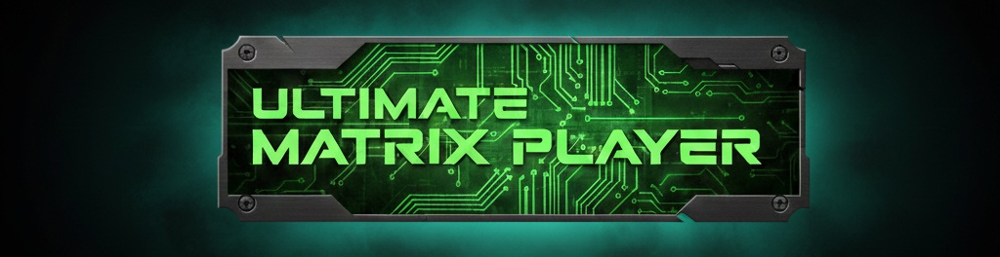
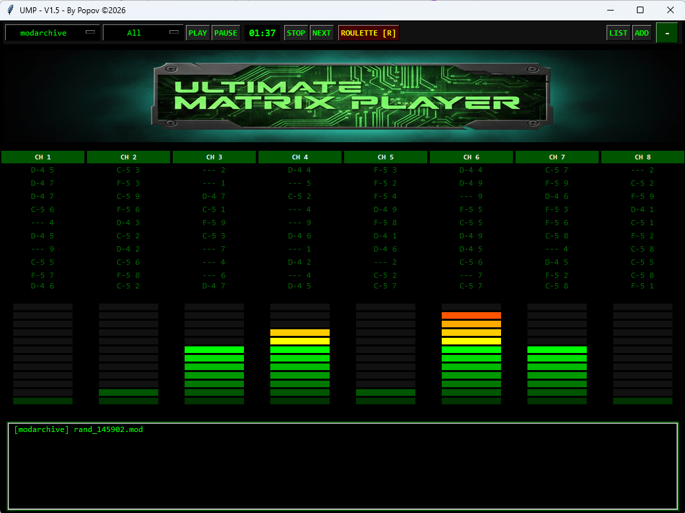
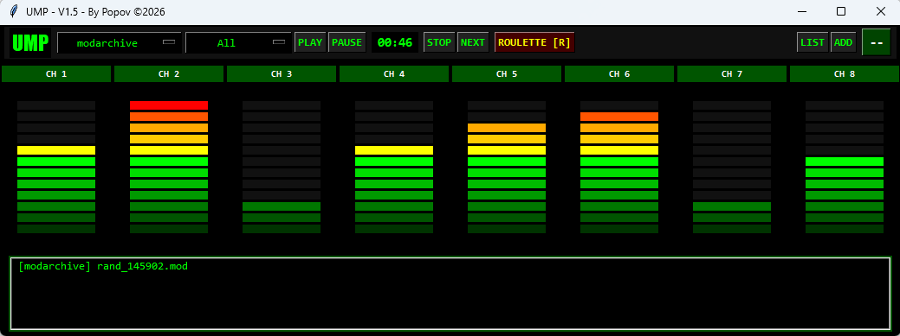
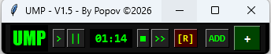

# 🎵 Ultimate Matrix Player (UMP)

[English](README.md) | **Français**



**Ultimate Matrix Player** est un lecteur de modules **MOD, S3M, XM et IT** très léger, écrit en
Python, pour les amateurs de demoscene, de chiptune et de musique Amiga. Il associe une
interface rétro façon « Matrix » à un mode roulette qui télécharge des modules depuis
[The Mod Archive](https://modarchive.org).

**Version actuelle : V1.6** (script `UMPV16.pyw`). Les nouveautés sont dans le
[journal des versions](#journal-des-versions).

---

## Sommaire

1. [Fonctionnalités](#fonctionnalités)
2. [Captures d'écran](#captures-décran)
3. [Installation et lancement](#installation-et-lancement)
4. [Utilisation](#utilisation)
5. [Fichier `config.ini`](#fichier-configini)
6. [Créer un exécutable Windows (.exe)](#créer-un-exécutable-windows-exe)
7. [Contenu du dépôt](#contenu-du-dépôt)
8. [Limites connues](#limites-connues)
9. [Journal des versions](#journal-des-versions)
10. [Crédits et licence](#crédits-et-licence)

---

## Fonctionnalités

- **Nom du module affiché** : le titre enregistré dans le fichier (le nom que le musicien a
  donné à son morceau sur Amiga ou PC) s'affiche en jaune sous la barre de commandes, dans
  la barre de titre de la fenêtre et dans la playlist. Si le module n'a pas de titre, c'est
  le nom du fichier qui s'affiche.
- **Formats** : MOD (Amiga, de 4 à 32 voies, y compris les vieux MOD à 15 instruments), S3M, XM
  et IT.
- **Mode roulette [R]** : télécharge un module au hasard et le lance aussitôt. Le
  téléchargement se fait en arrière-plan, sans figer l'interface.
- **Trois tailles d'interface**, que le bouton à droite fait défiler :
  - **Full** (grande) : logo, nom du module, 8 colonnes « Matrix », VU-mètres et playlist ;
  - **Mini** (moyenne) : nom du module, VU-mètres et playlist ;
  - **Nano** : simple barre de commandes. Le nom du module reste dans la barre de titre.
- **Playlist** : ajoute tes fichiers locaux avec **ADD**, puis double-clique sur une ligne pour
  la jouer.
- **Réglages mémorisés** dans `config.ini` : taille d'interface, affichage de la liste, source
  et catégorie choisies.

## Captures d'écran

| Full | Mini | Nano |
|---|---|---|
|  |  |  |

*(Ces captures datent de la V1.5 : la ligne du nom du module n'y figure pas encore.)*

## Installation et lancement

Il te faut **Python 3** et deux bibliothèques :

```bash
pip install pygame pillow
```

Lance ensuite le script :

```bash
python UMPV16.pyw
```

Sous Windows, un double-clic sur `UMPV16.pyw` suffit (l'extension `.pyw` évite l'ouverture
d'une console).

> Pillow ne sert qu'à afficher le logo : sans Pillow, le lecteur fonctionne quand même.
> Sous Linux, pygame a besoin de `libmodplug` pour lire les modules
> (`sudo apt install libmodplug1` sous Debian/Ubuntu).

## Utilisation

| Bouton | Rôle |
|---|---|
| **PLAY** / `>` | Lit le morceau en cours, reprend après une pause ou ouvre le sélecteur de fichiers si la playlist est vide |
| **PAUSE** / `\|\|` | Met en pause |
| **STOP** / `■` | Arrête la lecture |
| **NEXT** / `>>` | Passe au morceau suivant |
| **ROULETTE [R]** | Télécharge et lance un module au hasard (source et catégorie choisies dans les menus) |
| **LIST** | Affiche ou masque la playlist |
| **ADD** | Ajoute des fichiers locaux à la playlist |
| `-` / `--` / `+` | Change la taille de l'interface (Full → Mini → Nano) |

Double-clique sur une ligne de la playlist pour jouer ce morceau. La lecture enchaîne les
morceaux et repart au début à la fin de la liste.

## Fichier `config.ini`

Il est créé à côté du script (ou de l'exécutable) au premier lancement :

```ini
[SOURCES]
ModArchive = All, Chiptune, Demo
Modules.pl = S3M, IT, XM
Modland = Exotic
Amiga Collection = All

[SETTINGS]
mode = full
show_list = True
delay = 80
source = ModArchive
category = All
```

| Réglage | Rôle |
|---|---|
| `mode` | Taille de l'interface : `full`, `mini` ou `nano` |
| `show_list` | Affiche la playlist (`True` / `False`) |
| `delay` | Rafraîchissement de l'animation, en millisecondes (20 au minimum) |
| `source`, `category` | Dernières source et catégorie choisies |

La section `[SOURCES]` est réécrite à chaque lancement. Les valeurs de `[SETTINGS]` sont
enregistrées à la fermeture de la fenêtre.

Les modules téléchargés par la roulette sont rangés dans le dossier **`WebMods/`**. Il n'est pas
vidé automatiquement, mais les fichiers sont petits.

## Créer un exécutable Windows (.exe)

Avec [PyInstaller](https://pyinstaller.org), pour obtenir un `.exe` autonome avec le logo et
l'icône intégrés :

```bash
pip install pyinstaller
python -m PyInstaller --noconsole --onefile --add-data "logo.jpg;." --icon="Matrix.ico" UMPV16.pyw
```

L'exécutable se trouve ensuite dans le dossier `dist/`. Il crée son `config.ini` et son dossier
`WebMods/` à côté de lui.

## Contenu du dépôt

```
.
├── UMPV16.pyw          code source du lecteur
├── logo.jpg            bannière affichée en mode Full (intégrée au .exe)
├── Matrix.ico          icône de l'exécutable
├── Exemple_*.png       captures d'écran des trois modes
├── README.md           documentation en anglais
└── README.fr.md        ce fichier
```

Créés à l'exécution (non versionnés) : `config.ini` et le dossier `WebMods/`.

## Limites connues

- **Sources de la roulette** : seule **ModArchive** fait une vraie recherche par catégorie
  (All, Chiptune, Demo). Les entrées **Modules.pl**, **Modland** et **Amiga Collection** tirent
  pour l'instant un module au hasard dans le catalogue de The Mod Archive : elles n'interrogent
  pas encore ces sites.
- **Animation « Matrix »** : les notes qui défilent et les VU-mètres sont décoratifs. Ils ne
  reflètent pas le contenu réel du module.
- **Temps affiché** : il compte depuis le début du morceau, sans durée totale (pygame ne la
  fournit pas pour les modules).
- Les téléchargements se font en HTTPS **sans vérification du certificat**, pour éviter les
  erreurs de certificat sur certaines installations Windows.

## Journal des versions

### V1.6
- Le **nom du module** (titre stocké dans le fichier MOD, S3M, XM ou IT) s'affiche sous la barre
  de commandes, dans la barre de titre de la fenêtre et dans la playlist.
- Correction : la recherche par catégorie sur ModArchive ne s'exécutait jamais. `config.ini`
  mettait les noms des sources en minuscules (`modarchive`), alors le test sur `ModArchive`
  ne réussissait jamais.
- Correction : le type d'un module téléchargé est reconnu d'après son contenu. Un XM n'est plus
  enregistré en `.mod`, et une page d'erreur n'est plus enregistrée comme un module.
- Correction : une playlist où aucun fichier n'est lisible ne fait plus planter le programme
  (récursion sans fin).
- La roulette télécharge en arrière-plan : l'interface ne se fige plus. Sur les sources
  « au hasard », elle fait jusqu'à 5 essais si l'identifiant tiré n'existe pas.
- Double-clic sur une ligne de la playlist pour la jouer. Le morceau en cours est surligné.
- La source et la catégorie choisies sont mémorisées. Le réglage `delay` de `config.ini` est
  maintenant pris en compte.
- Le sélecteur de fichiers filtre les modules (`*.mod`, `*.s3m`, `*.xm`, `*.it`, et la
  convention Amiga `mod.*`).
- STOP remet le compteur à `00:00`.

### V1.5
- Première version publiée : trois modes d'affichage, roulette, playlist et `config.ini`.

## Crédits et licence

Projet libre d'utilisation pour tous les passionnés de musique tracker.

Bonne écoute ! Popov (mais pas Russe), 2026.

Merci à [Gemini](https://gemini.google.com) pour sa précieuse aide, et à
[The Mod Archive](https://modarchive.org) pour son catalogue.
